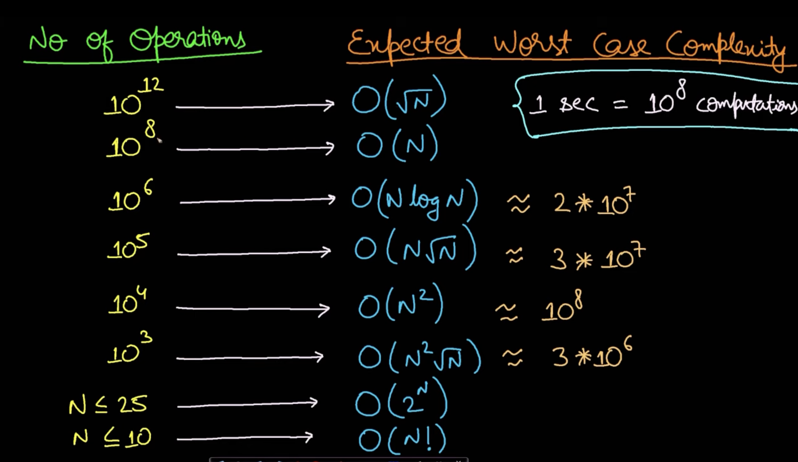
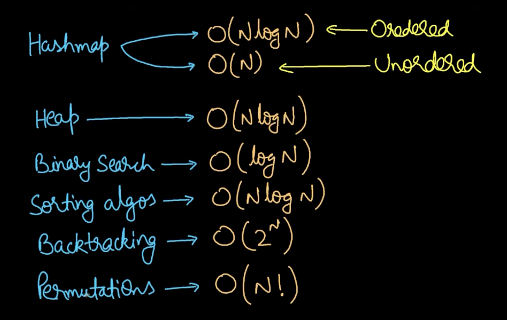

https://www.youtube.com/watch?v=_LCsw5J-Mj0

You can filter out the most probable algorithm by just reading the problem with it's constraints. Most people just miss to focus on constraints of the problem. The time complexity of algorithms are generally different. We need to solve the problem test case in 1 second which is just 10^8 computations. Keeping this in mind, when we check problem constraints, we can know about the maximum time complexity which will filter out the possible algorithms.

